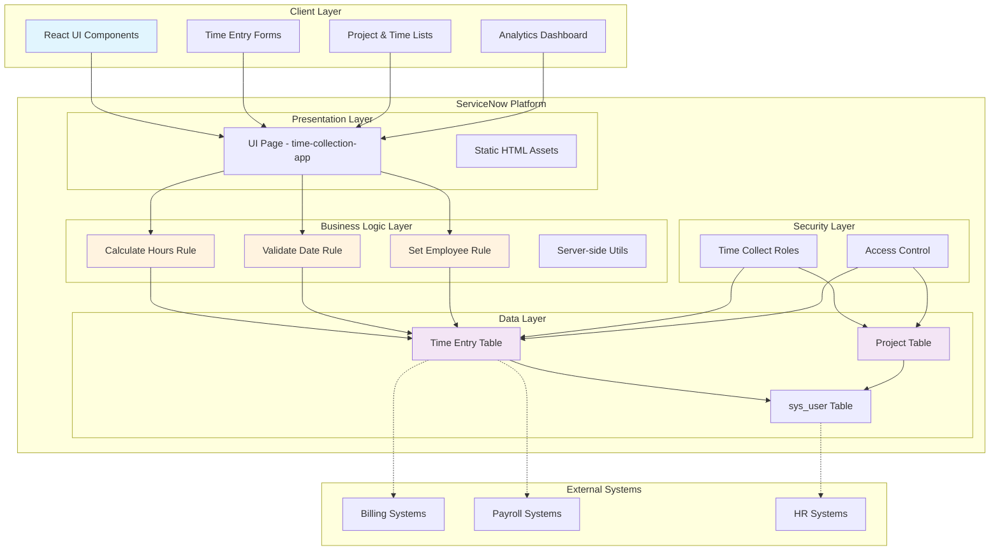

# 🕒 Time Collect - ServiceNow Time Tracking Application

> A comprehensive time tracking application for professional services organizations to log work hours, track project time, and manage timesheets for billing and payroll purposes.

[](https://docs.servicenow.com/sdk)
[](https://reactjs.org/)
[](LICENSE)

## 📋 Table of Contents

- [Features](#-features)
- [Architecture](#-architecture)
- [Getting Started](#-getting-started)
- [Usage](#-usage)
- [Data Model](#-data-model)
- [API Reference](#-api-reference)
- [Development](#-development)
- [Contributing](#-contributing)

## ✨ Features

### 📊 Core Functionality
- **Time Entry Management**: Log detailed work hours with project, client, and task information
- **Project Tracking**: Manage projects with budgets, timelines, and billing configurations
- **Multi-Work Type Support**: Track different types of work (Design, Analysis, Field Work, etc.)
- **Billable/Non-Billable Classification**: Separate billable client work from internal activities
- **Approval Workflow**: Manager review and approval process for time entries
- **Real-time Analytics**: Live dashboard showing time distribution and project progress

### 🎯 Business Features
- **Multiple Billing Types**: Hourly, Fixed Price, Time & Materials, Retainer
- **Status Tracking**: Draft → Submitted → Approved → Invoiced workflow
- **Budget Management**: Track hours and costs against project budgets
- **Employee Management**: Integration with ServiceNow user management
- **Audit Trail**: Complete audit history of all time entries and changes

### 💻 Technical Features
- **React Frontend**: Modern, responsive user interface
- **ServiceNow Integration**: Native platform integration using Now SDK Fluent
- **Automated Calculations**: Automatic hour calculation from start/end times
- **Data Validation**: Business rules ensure data integrity and consistency
- **RESTful APIs**: Full CRUD operations with web service access

## 🏗️ Architecture



### Component Overview

| Layer | Components | Purpose |
|-------|------------|---------|
| **Client** | React Components | User interface, form handling, real-time updates |
| **Presentation** | UI Pages | ServiceNow integration point for React app |
| **Business Logic** | Business Rules | Automated calculations, validations, workflows |
| **Data** | Tables & Records | Time entries, projects, user management |
| **Security** | Roles & ACLs | Access control and permission management |

## 🚀 Getting Started

### Prerequisites

- ServiceNow instance (Paris release or later)
- ServiceNow SDK 4.0.2+
- Node.js 16+ (for local development)
- Git

### Installation

1. **Clone the repository**
   ```bash
   git clone <repository-url>
   cd time-collect-app
   ```

2. **Install dependencies**
   ```bash
   npm install
   ```

3. **Configure ServiceNow connection**
   ```bash
   # Update now.config.json with your instance details
   {
     "instance": "your-instance.service-now.com",
     "scope": "x_snc_time_collect"
   }
   ```

4. **Build the application**
   ```bash
   npm run build
   ```

5. **Deploy to ServiceNow**
   ```bash
   npm run deploy
   ```

### Quick Start

1. Navigate to your ServiceNow instance
2. Go to **Time Collect** → **Time Collection App**
3. Start logging your first time entry!

## 📱 Usage

### Logging Time Entries

1. **Select a Project**: Choose from active projects in the dropdown
2. **Enter Work Details**: 
   - Work date and time range
   - Work type (Design, Analysis, Field Work, etc.)
   - Detailed task description
3. **Set Billing Status**: Mark as billable or non-billable
4. **Save Entry**: Entry is automatically validated and calculated

### Managing Projects

Projects can be created and managed through the ServiceNow platform with:
- Project codes and names
- Client information
- Budget tracking (hours and amount)
- Billing configuration
- Status management

### Approval Workflow

1. **Draft**: Initial entry by employee
2. **Submitted**: Ready for manager review
3. **Approved/Rejected**: Manager decision with notes
4. **Invoiced**: Final state for billing

## 📊 Data Model

### Time Entry Table (`x_snc_time_collect_time_entry`)

| Field | Type | Description |
|-------|------|-------------|
| `employee` | Reference (sys_user) | Employee who performed the work |
| `project_code` | String | Project identifier |
| `client_name` | String | Client organization name |
| `task_description` | String | Detailed work description |
| `work_date` | Date | Date work was performed |
| `start_time` | DateTime | Work start time |
| `end_time` | DateTime | Work end time |
| `hours_worked` | Decimal | Calculated hours (auto-computed) |
| `work_type` | Choice | Type of work performed |
| `billable` | Boolean | Whether time is billable |
| `status` | Choice | Approval status |
| `billing_rate` | Decimal | Rate for billing calculations |

### Project Table (`x_snc_time_collect_project`)

| Field | Type | Description |
|-------|------|-------------|
| `project_code` | String | Unique project identifier |
| `project_name` | String | Descriptive project name |
| `client_name` | String | Client organization |
| `project_manager` | Reference (sys_user) | Responsible manager |
| `budget_hours` | Decimal | Allocated hours |
| `budget_amount` | Decimal | Budget in dollars |
| `billing_type` | Choice | Billing model |
| `status` | Choice | Project lifecycle status |

## 🔌 API Reference

### REST Endpoints

The application exposes standard ServiceNow REST APIs:

- **Time Entries**: `/api/now/table/x_snc_time_collect_time_entry`
- **Projects**: `/api/now/table/x_snc_time_collect_project`

### Business Rules

- **Calculate Hours**: Auto-calculates duration from start/end times
- **Validate Date**: Ensures work dates are reasonable
- **Set Employee**: Defaults employee to current user

### Client API

React components use utility functions for ServiceNow integration:
- `display()`: Extract display values from ServiceNow records
- `value()`: Extract raw values from ServiceNow records

## 🛠️ Development

### Project Structure

```
src/
├── client/                 # React frontend components
│   ├── components/         # Reusable UI components
│   │   ├── TimeEntryForm.jsx
│   │   ├── TimeEntryList.jsx
│   │   ├── ProjectList.jsx
│   │   └── Analytics.jsx
│   ├── utils/             # Client-side utilities
│   └── app.jsx           # Main application
├── fluent/               # ServiceNow metadata definitions
│   ├── tables/          # Table definitions
│   ├── business-rules/  # Server-side logic
│   ├── roles/          # Security roles
│   └── ui-pages/       # UI page definitions
└── server/              # Server-side JavaScript modules
    └── time-entry-utils.js
```

### Building and Testing

```bash
# Build the application
npm run build

# Deploy to development instance  
npm run deploy

# Run transformation (convert metadata)
npm run transform

# Generate TypeScript definitions
npm run types
```

### Adding New Features

1. **New Tables**: Add `.now.ts` files in `src/fluent/tables/`
2. **Business Logic**: Create business rules in `src/fluent/business-rules/`
3. **UI Components**: Add React components in `src/client/components/`
4. **Security**: Define roles and ACLs in appropriate fluent files

### Code Style

- Use TypeScript for all `.now.ts` files
- Follow React best practices for components
- Include comprehensive JSDoc comments
- Maintain consistent naming conventions

## 🤝 Contributing

1. Fork the repository
2. Create a feature branch (`git checkout -b feature/amazing-feature`)
3. Commit your changes (`git commit -m 'Add amazing feature'`)
4. Push to the branch (`git push origin feature/amazing-feature`)
5. Open a Pull Request

### Development Guidelines

- Follow ServiceNow Fluent best practices
- Write unit tests for new functionality
- Update documentation for API changes
- Test on latest ServiceNow release

## 📄 License

This project is UNLICENSED. See the [LICENSE](LICENSE) file for details.

## 🆘 Support

- **Documentation**: [ServiceNow SDK Documentation](https://docs.servicenow.com/sdk)
- **Issues**: Create an issue in this repository
- **Community**: ServiceNow Developer Community

## 📈 Roadmap

- [ ] Mobile app support
- [ ] Advanced reporting and analytics
- [ ] Integration with external billing systems
- [ ] Automated invoice generation
- [ ] Resource planning and forecasting
- [ ] Multi-currency support

---

**Built with ❤️ using ServiceNow Fluent and React**

*Transform how your organization tracks time and manages projects with modern, intuitive tools built on the ServiceNow platform.*